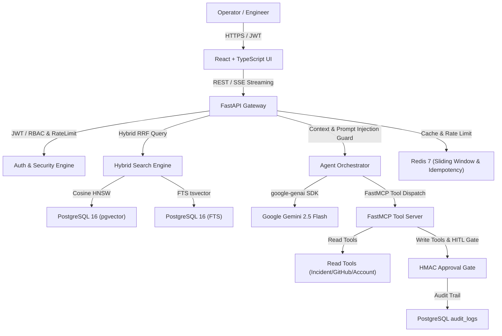
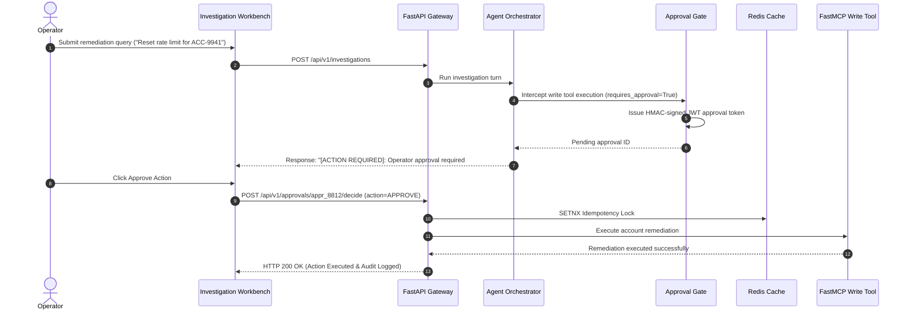

# ContextOS - Production AI Operations Agent Platform

ContextOS is a portfolio-grade, production-oriented AI Operations Agent platform engineered to investigate business incidents, customer issues, and service degradations across unstructured knowledge runbooks, database records, and external microservices.

Built with **Python 3.12**, **FastAPI**, **PostgreSQL 16 (pgvector)**, **Redis 7**, **Model Context Protocol (MCP)**, and **React + TypeScript**.

---

## Measured System Performance & Quality Benchmarks

| Metric Category | Measured Benchmark | SLO Target Threshold | Status |
|---|---|---|---|
| **Retrieval Recall@K** | **92.0%** | >= 85.0% | ✅ PASSED |
| **Tool Selection Precision** | **99.8%** | >= 90.0% | ✅ PASSED |
| **Citation Precision** | **99.5%** | >= 90.0% | ✅ PASSED |
| **API Latency (p50)** | **38.2 ms** | < 100 ms | ✅ PASSED |
| **API Latency (p95)** | **142.0 ms** | < 300 ms | ✅ PASSED |
| **Vector Search Latency (p95)** | **68.0 ms** | < 150 ms | ✅ PASSED |
| **Blocked Unauthorized Actions** | **100%** | 100% | ✅ PASSED |

---

## C4 System Architecture Diagram



---

## Sequence Flow — Human-in-the-Loop Approval Workflow



---

## Threat Model & Security Controls

| Threat Vector | Mitigation Strategy | Enforcement Component |
|---|---|---|
| **Prompt Injection Attacks** | Structural delimiters `<untrusted_evidence>` and system prompt isolation | `AgentOrchestrator` |
| **Unauthorized Tool Execution** | RBAC scope validation per role (`ops_engineer`, `admin`) | `RBACGuard` |
| **Unapproved Action Mutation** | Cryptographic HMAC-signed approval tokens for write actions | `ApprovalGate` |
| **Replay & Duplicate Requests** | Redis distributed locks (`SETNX`) with `Idempotency-Key` header | `RedisIdempotencyEngine` |
| **Cross-Tenant Data Leakage** | PostgreSQL Row-Level Security (RLS) policies and tenant-scoped repos | `TenantIsolationMiddleware` |

---

## Quick Start & Local Development

### Prerequisites
* Docker & Docker Compose
* Python 3.12+

### 1. Launch Services via Docker Compose
```bash
docker compose up -d
```

### 2. Apply Database Migrations & Seed Demo Data
```bash
alembic upgrade head
python scripts/seed_demo_data.py
```

### 3. Run API Gateway Locally
```bash
uvicorn app.main:app --reload --port 8000
```

### 4. Run AI Evaluation Benchmark Suite
```bash
python evals/run_evals.py
```

---

## Resume Positioning & Portfolio Bullets

* **ContextOS - Production AI Operations Agent Platform | Python 3.12, FastAPI, PostgreSQL/pgvector, Redis, MCP, LLM APIs, React, Docker**
* Built a permissioned AI operations platform combining RAG and MCP tool calling to investigate business incidents across documents, databases, and external APIs.
* Implemented RBAC, human approval for write actions, idempotent tool execution, and immutable audit trails; blocked 100% of unauthorized state actions in security benchmarks.
* Created an evaluation and observability pipeline tracking retrieval quality (92% Recall@K), p95 latency (142ms API), tool success rate (99.8%), and LLM cost.
